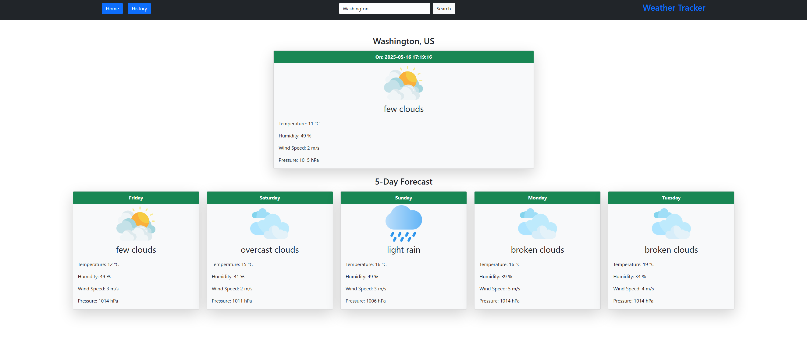
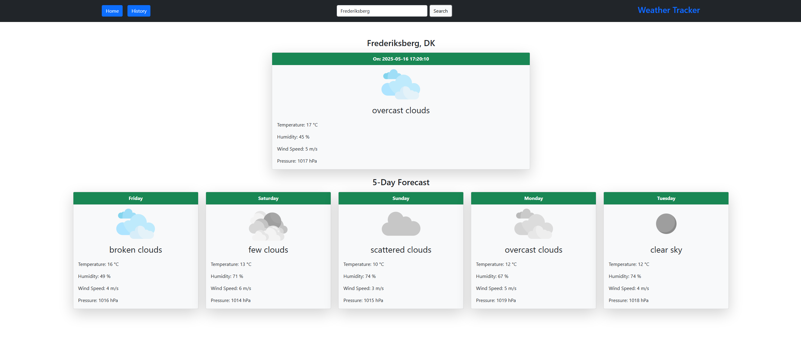
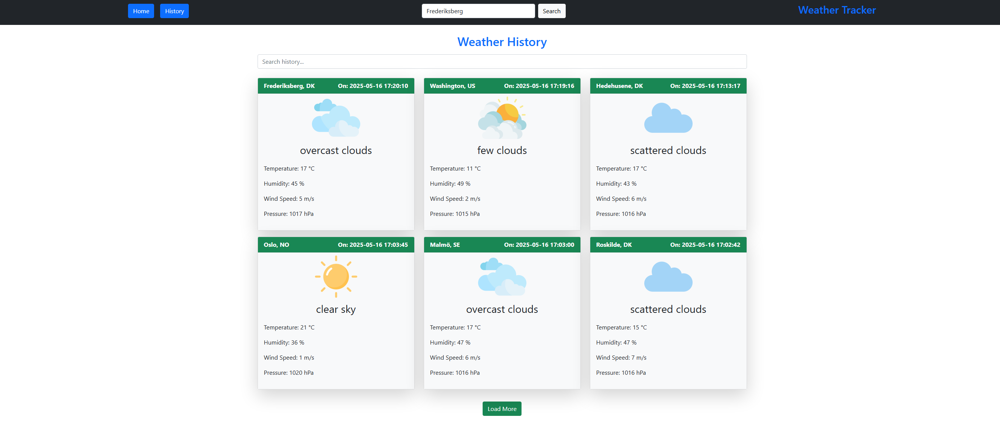

# WeatherTrackerAPI + Angular Front-End

This is a simple weather tracking web application that allows you to search for a city and view its current weather along with a 5-day forecast.

## Key Features

- **City Search:** Enter a city name to see the current weather and a 5-day forecast for that location.
- **History:** Click the "History" button to view previously searched cities and their weather data stored in the database, complete with date and time stamps.
- **Search in History:** Use the search input on the History page to find weather data for previously searched cities.

## Installation and Running

### Backend (.NET API)

1. Clone the repository and open the project in Visual Studio or VS Code.
2. Create your database, then apply Entity Framework Core migrations to update the database schema:

VS-2022 Packet manager console:  
if needed add migration : add-migration {YOU NAME IT}
Then : update-database

### Frontend(Angular standalone):
1. Navigate to the Angular project folder.

2. Install the required dependencies:
CMD : npm install

3. Run the project with: 
ng serve -o

